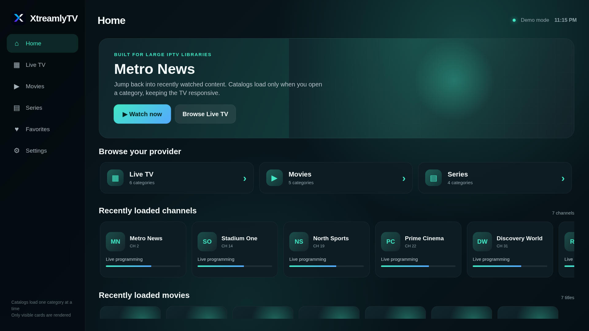
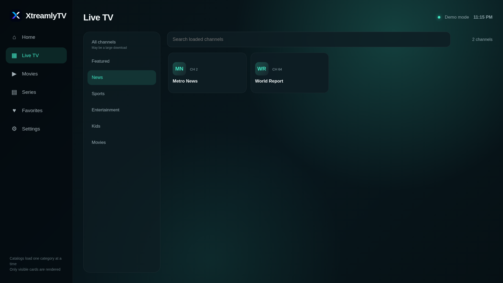
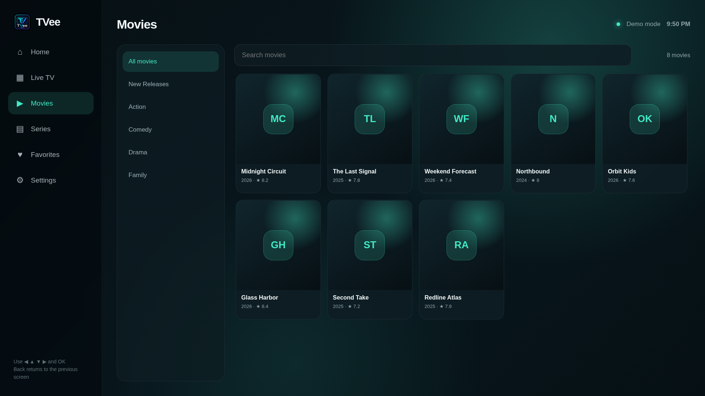
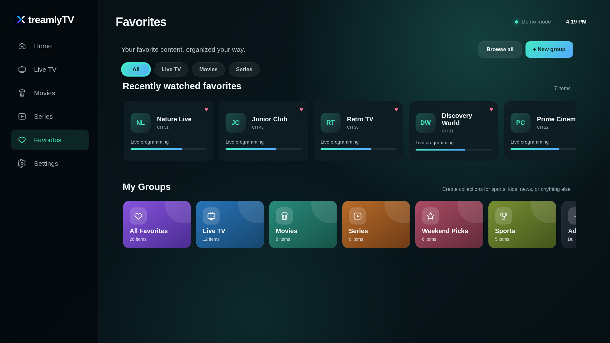
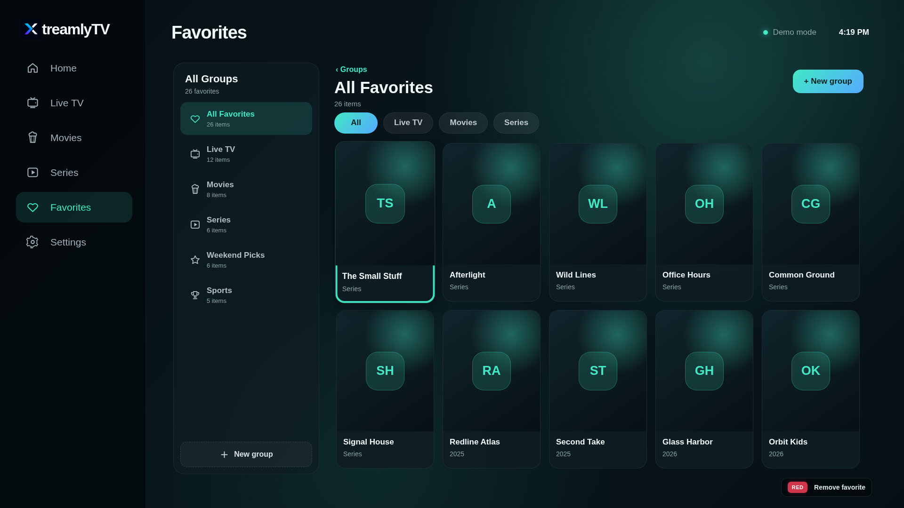

# XtreamlyTV

XtreamlyTV is an open-source, remote-first IPTV client for living-room televisions. It connects to user-supplied Xtream-compatible providers and presents Live TV, Movies, and Series in a fast, category-scoped interface built for very large catalogs.

> XtreamlyTV does not provide channels, subscriptions, playlists, or copyrighted media. Use it only with services and content you are authorized to access.

## Platform status

| Platform | Status | Package | Playback |
|---|---|---|---|
| LG webOS TV | Beta; daily-driver testing | `.ipk` | Native webOS HTML media surface |
| Android TV / Google TV | Developer preview | `.apk` | AndroidX Media3 ExoPlayer |
| Local browser demo | Development only | Static files | Browser media support |

The Android TV target is intended for Google TV and Android TV devices such as supported TCL and Sony televisions, Chromecast with Google TV, NVIDIA Shield, and similar devices. It is an initial native target and does not yet have complete feature parity with webOS.

## Features

- Xtream provider authentication
- Category-scoped Live TV, VOD, and Series browsing
- Virtualized large-catalog navigation
- Favorite groups, media filter chips, and recently watched favorites
- Movie and episode resume positions on webOS
- Live HLS/MPEG-TS fallback on webOS
- Native Media3 playback on Android TV
- Remote-first navigation and focus states
- Multiple color skins on webOS
- Optional LAN API bridge for providers that block browser CORS
- No advertising, analytics, or tracking

## Monorepo layout

```text
apps/
  webos/          LG webOS packaged app
  android-tv/     Native Android TV / Google TV app
  api-bridge/     Optional local metadata/CORS bridge
packages/
  core-web/       Shared browser/webOS Xtream and persistence primitives
  contracts/      Platform-neutral JSON schemas and fixtures
  design-tokens/  Shared brand, spacing, color, and motion tokens
  brand/          Canonical project artwork
scripts/          Build, install, synchronization, and release helpers
docs/             Architecture, development, testing, and release guides
.github/           CI, release workflows, templates, and dependency updates
```

The repository shares provider contracts, brand assets, design tokens, fixtures, and web-compatible domain primitives. Playback and UI shells remain platform-native so each television platform can use its best-supported media engine.

## Quick start

### Prerequisites

- Git
- Node.js 20 or newer
- Python 3.11+ for browser smoke tests
- LG webOS CLI for webOS builds
- Android Studio or Android SDK/JDK 17 for Android TV builds

Prepare generated platform files:

```bash
npm run prepare:apps
npm run check:webos
npm run test:core
```

### Build webOS

```bash
npm install -g @webos-tools/cli
npm run build:webos
```

Output:

```text
dist/webos/com.github.xtreamlytv.webos_0.4.1_all.ipk
```

### Build Android TV

```bash
cd apps/android-tv
./gradlew :app:assembleDebug
```

Windows:

```powershell
cd apps\android-tv
.\gradlew.bat :app:assembleDebug
```

Output:

```text
apps/android-tv/app/build/outputs/apk/debug/app-debug.apk
```

## Documentation

- [Getting started](docs/getting-started.md)
- [Architecture](docs/architecture.md)
- [Build and test on LG webOS](docs/development/webos.md)
- [Build and test on Android TV / Google TV](docs/development/android-tv.md)
- [Debugging and diagnostics](docs/development/debugging.md)
- [Release process](docs/releasing.md)
- [Roadmap](docs/roadmap.md)
- [Brand assets](docs/brand.md)
- [0.4.1 release notes](docs/release-notes/0.4.1.md)
- [0.4.0 release notes](docs/release-notes/0.4.0.md)
- [Publish the initial GitHub repository](docs/github-publishing.md)
- [Contributing](CONTRIBUTING.md)
- [Security policy](SECURITY.md)
- [Privacy](PRIVACY.md)

## Screenshots











## Development principles

1. Never fetch a provider's entire catalog unless the API offers no category-scoped alternative.
2. Keep remote navigation deterministic and visibly focused.
3. Use platform-native playback where practical.
4. Never ship provider credentials, playlists, or copyrighted content.
5. Treat provider responses as untrusted and inconsistent.
6. Keep logs free of passwords and authenticated stream URLs.

## License

MIT. See [LICENSE](LICENSE).
